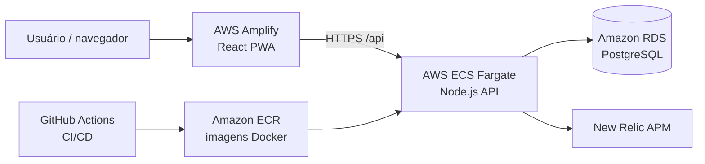
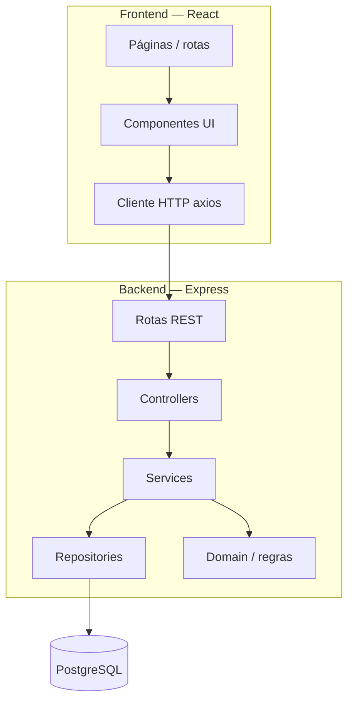

# Arquitetura e RFC — Planit Go

Documentação técnica da solução para revisão no repositório: visão geral, requisitos funcionais, decisões de arquitetura e mapeamento para o código-fonte.

> **RFC formal (PDF):** [RFC_PlanitGo.pdf](./RFC_PlanitGo.pdf) — documento acadêmico completo do projeto. Este arquivo (`arquitetura.md`) é um resumo navegável no GitHub, com diagramas e links para o código.

Não é necessário ambiente local para entender a estrutura; para executar localmente, veja [desenvolvimento.md](./desenvolvimento.md).

---

## 1. Visão geral

O **Planit Go** é uma aplicação web para planejamento de viagens com controle de orçamento, registro de gastos, itinerário diário e relatórios comparativos.

### Diagrama de implantação (produção)



### Diagrama lógico (camadas)



---

## 2. Stack tecnológica

| Camada | Tecnologia | Versão / nota |
|--------|------------|---------------|
| Frontend | React, Vite, React Router | Node ≥ 20 |
| PWA | vite-plugin-pwa, Workbox | Instalável, cache de assets |
| Backend | Node.js, Express | Node 22 em produção (Docker/CI) |
| Banco | PostgreSQL | Migrations SQL em `backend/migrations/` |
| Auth | JWT + bcrypt | Token no header `Authorization` |
| Testes FE | Vitest, Testing Library | `frontend/src/**/*.test.jsx` |
| Testes BE | Node test runner, supertest, c8 | `backend/test/` |
| Qualidade | SonarCloud | Monorepo backend + frontend |
| Observabilidade | New Relic agent | `backend/newrelic.cjs` |
| Cloud | Amplify, ECS, ECR, RDS | Região sa-east-1 |

---

## 3. Requisitos funcionais (mapeamento)

| RF | Descrição | Implementação |
|----|-----------|---------------|
| RF01 | Cadastro e autenticação | `auth.routes.js`, `auth.service.js`, `LoginPage`, `RegisterPage` |
| RF02 | Cadastro de viagem com perfil e orçamento | `trip.service.js`, `tripProfiles.js`, `CreateTripPage`, `TripBudgetPage` |
| RF03 | Distribuição automática do orçamento | `distribution.js`, perfis em `tripProfiles.js` |
| RF04 | Registro de gastos reais | `expense.service.js`, `ExpenseForm`, `ExpenseList` |
| RF05 | Itinerário por dia | `itinerary.service.js`, `ItineraryDaySection` |
| RF06 | Relatório planejado × realizado | `TripReportPage`, `reportInsights.js`, `budgetAlerts.js` |
| RF07 | Histórico e status da viagem | `tripStatus.js`, `TripsPage`, `TripCard` |
| RF08 | PWA instalável | `vite.config.js` (VitePWA), ícones em `frontend/public/` |

---

## 4. API REST (resumo)

Base: `/api` (prefixo; health em `/health`).

| Método | Rota | Auth | Descrição |
|--------|------|------|-----------|
| POST | `/api/auth/register` | Não | Cadastro |
| POST | `/api/auth/login` | Não | Login (retorna JWT) |
| GET | `/api/trip-profiles` | Não | Lista perfis e percentuais |
| GET | `/api/trips` | Sim | Lista viagens do usuário |
| POST | `/api/trips` | Sim | Cria viagem |
| GET | `/api/trips/:id` | Sim | Detalhe |
| PATCH | `/api/trips/:id` | Sim | Atualiza viagem |
| DELETE | `/api/trips/:id` | Sim | Remove viagem |
| GET/POST | `/api/trips/:id/expenses` | Sim | Gastos |
| GET/POST | `/api/trips/:id/itinerary` | Sim | Itinerário |
| GET | `/api/trips/:id/budget` | Sim | Resumo orçamentário |

Rotas protegidas exigem header `Authorization: Bearer <token>`.

---

## 5. Segurança

- **Senhas:** hash bcrypt no cadastro.
- **JWT:** assinado com `JWT_SECRET`; expiração configurável (`JWT_EXPIRES_IN`).
- **Helmet:** headers HTTP de segurança no Express.
- **CORS:** origem restrita em produção via `CORS_ORIGIN` (URL do Amplify).
- **Rate limit:** `express-rate-limit` — login/cadastro (10 req/15 min por IP) e demais rotas `/api` (300 req/15 min). Desativado em `NODE_ENV=test`.
- **SSL RDS:** conexão PostgreSQL com SSL em produção (`DATABASE_SSL`).

---

## 6. Estrutura de pastas

```
Planit-Go/
├── frontend/          # SPA React (Amplify)
│   └── src/
│       ├── pages/     # Telas por rota
│       ├── components/
│       ├── api/       # Cliente HTTP
│       └── utils/
├── backend/           # API Express (ECS)
│   └── src/
│       ├── routes/
│       ├── controllers/
│       ├── services/
│       ├── repositories/
│       ├── domain/
│       └── middleware/
├── .github/workflows/ # CI, Sonar, deploy API
└── docs/              # Documentação
```

---

## 7. Decisões de arquitetura

| Decisão | Motivo |
|---------|--------|
| Monorepo frontend + backend | CI unificado, Sonar em um projeto, deploy independente por pasta |
| SPA + API REST | Separação clara; frontend estático no Amplify, API escalável no ECS |
| PostgreSQL | Relações entre usuário, viagem, gastos e itinerário |
| Migrations SQL manuais | Simplicidade; script `npm run migrate` no entrypoint Docker |
| JWT stateless | Adequado para API em containers sem sessão compartilhada |
| New Relic no backend | APM de requisições, erros e performance da API em produção |
| Imagens de capa locais (`public/covers/`) | Evita dependência de CDN externo (Unsplash) nos cards |

---

## 8. Variáveis de ambiente (produção)

| Variável | Onde | Função |
|----------|------|--------|
| `DATABASE_URL` | ECS task | Conexão RDS |
| `JWT_SECRET` | ECS task | Assinatura do token |
| `CORS_ORIGIN` | ECS task | URL do Amplify |
| `NEW_RELIC_LICENSE_KEY` | ECS task | Ativa APM |
| `VITE_API_URL` | Amplify | URL pública da API |

Detalhes em [desenvolvimento.md](./desenvolvimento.md) e [deploy.md](./deploy.md).

---

[← Voltar à entrega](./ENTREGA.md) · [Manual do usuário](./manual-usuario.md) · [Deploy](./deploy.md)
