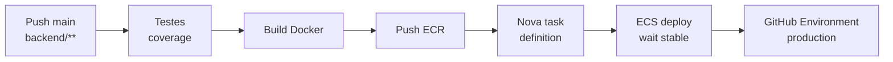

# CI/CD — Planit Go

Este documento descreve as esteiras de integração contínua, análise de qualidade e deploy automatizado do projeto. Todos os workflows estão versionados em `.github/workflows/` e podem ser conferidos diretamente no GitHub Actions.

---

## Visão geral

| Workflow | Arquivo | Gatilho | Função |
|----------|---------|---------|--------|
| **CI** | [`ci.yml`](../.github/workflows/ci.yml) | PR + push `dev`/`main` | Testes + build frontend |
| **SonarCloud** | [`sonar.yml`](../.github/workflows/sonar.yml) | PR + push `dev`/`main` | Cobertura + análise estática |
| **Deploy API** | [`deploy-api.yml`](../.github/workflows/deploy-api.yml) | Push `main` (`backend/**`) | Test → ECR → ECS |

**Painel:** https://github.com/guimachado1/Planit-Go/actions

**Deploys (ambiente production):** https://github.com/guimachado1/Planit-Go/deployments

---

## 1. CI — validação em cada alteração

```yaml
# Resumo do fluxo
backend:  checkout → Node 22 → npm ci → test:coverage
frontend: checkout → Node 22 → npm ci → test:coverage → build
```

Garante que código na `dev` e em PRs não quebra testes nem o build do React.

---

## 2. SonarCloud — qualidade e cobertura

Executa testes com cobertura em backend e frontend, depois envia resultados ao SonarCloud.

- Organization: `guimachado1`
- Project: `guimachado1_Planit-Go`
- Secret: `SONAR_TOKEN`

Detalhes em [qualidade.md](./qualidade.md).

---

## 3. Deploy API — produção (ECS)

Fluxo do job `deploy` (após `test` passar):



### Características

- **Concurrency:** um deploy por branch; não cancela em andamento
- **Environment:** `production` com URL https://www.planitgo.site
- **Permissions:** `deployments: write` para histórico no GitHub
- **Imagem:** tag `github.sha` + `latest`

### Frontend (Amplify)

O deploy do frontend **não** passa por este workflow. O Amplify detecta push na `main` e executa o build definido em `frontend/amplify.yml`.

---

## Branching sugerido

| Branch | Uso |
|--------|-----|
| `dev` | Desenvolvimento; CI + Sonar |
| `main` | Produção; merge dispara deploy API + Amplify |

---

## Secrets e variáveis (GitHub)

### Secrets

| Nome | Uso |
|------|-----|
| `AWS_ACCESS_KEY_ID` | Deploy ECS |
| `AWS_SECRET_ACCESS_KEY` | Deploy ECS |
| `SONAR_TOKEN` | SonarCloud scan |

### Variables (opcionais — defaults no workflow)

`AWS_REGION`, `ECR_REPOSITORY`, `ECS_CLUSTER`, `ECS_SERVICE`, `ECS_TASK_DEFINITION`, `ECS_CONTAINER_NAME`

---

## Como verificar

| O que conferir | Link ao vivo | Prints (alternativa) |
|----------------|--------------|----------------------|
| CI (testes + build) | [Workflow CI](https://github.com/guimachado1/Planit-Go/actions/workflows/ci.yml) | [evidencias/github-actions/](./evidencias/github-actions/) |
| SonarCloud (pipeline) | [Workflow SonarCloud](https://github.com/guimachado1/Planit-Go/actions/workflows/sonar.yml) | [evidencias/github-actions/](./evidencias/github-actions/) |
| Deploy da API | [Workflow Deploy API](https://github.com/guimachado1/Planit-Go/actions/workflows/deploy-api.yml) | [evidencias/github-actions/](./evidencias/github-actions/) |
| Histórico de deploys | [Deployments → production](https://github.com/guimachado1/Planit-Go/deployments) | [evidencias/github-actions/](./evidencias/github-actions/) |
| Arquivos dos workflows | [`.github/workflows/`](../.github/workflows/) | — |

Tabela completa de links e evidências: [evidencias/README.md](./evidencias/README.md).

---

## Comandos locais equivalentes

```bash
# Mesmo que o job backend do CI
cd backend && npm ci && npm run test:coverage

# Mesmo que o job frontend do CI
cd frontend && npm ci && npm run test:coverage && npm run build
```

---

[← Voltar à entrega](./ENTREGA.md) · [Deploy](./deploy.md) · [Qualidade](./qualidade.md)
